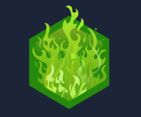
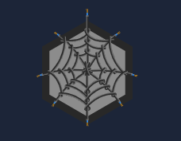
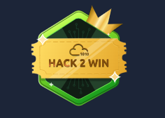

# Hey there 👋

---

### 👨‍🎓 About Me
Dedicated B.Tech Computer Science student specializing in **Cyber Security** at **Amrita Vishwa Vidyapeetham, Coimbatore**. Skilled in identifying vulnerabilities, securing systems, and analyzing threats with strong problem-solving abilities and hands-on experience in security projects. A proactive, detail-focused team player with strong communication skills, committed to continuous learning and contributing to a safe, secure, and collaborative environment.

---

### 🛠️ Languages & Tools

  
    
  

  
    
  

  
    
  

  
    
  

  
    
  

  
    
  

## 🛡️ Cybersecurity Tools & Skills

---

## 🧪 TryHackMe Badges

  <!-- 3 Day Streak -->
  
    
  

  <!-- Webbed -->
  
    
  

  <!-- cat linux.txt -->
  
    
  

  <!-- Raffle Royalty -->
  
    
  

---

### 🧰 Developer Tools & IDEs

  
    
  

  
    
  

  
    
  

---

### 🐧 Operating Systems

  
    
  

  
    
  

  
    
  

---

### 🌍 Socials

---
