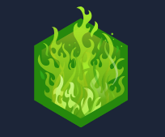
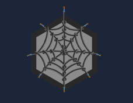
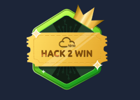
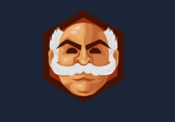
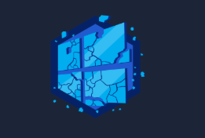

# Hey there 👋

---

### 👨‍🎓 About Me
Dedicated B.Tech Computer Science student specializing in **Cyber Security** at **Amrita Vishwa Vidyapeetham, Coimbatore**. Skilled in identifying vulnerabilities, securing systems, and analyzing threats with strong problem-solving abilities and hands-on experience in security projects. A proactive, detail-focused team player with strong communication skills, committed to continuous learning and contributing to a safe, secure, and collaborative environment.

---

## Contribution Streak

### 🛠️ Languages & Tools

  
    
  

  
    
  

  
    
  

  
    
  

  
    
  

  
    
  

## 🛡️ Cybersecurity Tools & Skills

### 🔎 Reconnaissance & Enumeration

### 🌐 Web Application Security

### 🌐 Network Security

### 🧪 Forensics & CTF Tools

## 💻 Languages & Scripting

**Focus Areas:**  
OWASP Top 10 • Web Enumeration • Directory Discovery • Vulnerability Identification • Exploitation Fundamentals • HTTP/HTTPS

**Networking:**  
TCP/IP • DNS • HTTP/HTTPS • SSH • Network Enumeration • Packet Analysis • Firewall Concepts

---

##  TryHackMe Badges

  <!-- 3 Day Streak -->
  
    
  

  <!-- Webbed -->
  
    
  

  <!-- cat linux.txt -->
  
    
   

  <!-- Raffle Royalty -->
  
    
  

<!-- MR Robot -->
  
    
  

  <!-- Blue -->
  
    
  

---

###  Developer Tools & IDEs

  
    
  

  
    
  

  
    
  

---

###  Operating Systems

  
    
  

  
    
  

  
    
  

---
##  Featured Projects

### 🛡️ Web Application Firewall (WAF)
A custom-built Web Application Firewall that allows even non-technical users to **create custom security rules**, monitor requests, and detect attacks in real time.
- User-friendly rule creation interface designed for non-technical users
- Real-time monitoring of incoming HTTP requests
- Detects SQL Injection, XSS, LFI, RCE, and pattern-based attacks
- Dynamic request blocking using custom rule logic
- Analytics dashboard for viewing blocked requests and attack patterns
- Built to be lightweight, modular, and easy to integrate in any environment

### 🚑 IoT-Driven Smart Ambulance System  
A real-time IoT solution for optimizing emergency response using:
- GPS-based location tracking  
- Real-time traffic updates  
- Patient vitals monitoring  
- Automatic hospital alerting  
Designed to reduce ambulance travel time and improve critical care.

### 🔒 Secure-Connect-System (BLOMS Scheme)  
A secure communication system implementing the **BLOMS Key Pre-Distribution Scheme** to enable:
- Encrypted peer-to-peer communication  
- Robust key management  
- Scalable secure network connectivity

---

## 🧪 Hands-on Cybersecurity Experience

### TryHackMe

- Completed **23+ hands-on cybersecurity rooms** covering reconnaissance, network enumeration, web security, vulnerability assessment, and exploitation.
- Practiced **active/passive reconnaissance, service enumeration, directory discovery, web application testing, and vulnerability identification** using Nmap, Burp Suite, Metasploit, Gobuster, and Feroxbuster.
- Achieved **Top 20% global ranking** and earned **6 cybersecurity badges**.

### Capture The Flag (CTF) Experience

#### 🖥️ Vulnerable Machines & Security Labs

- **Mr. Robot CTF** — Web enumeration, vulnerability identification, WordPress security testing, and Linux privilege escalation.
- **Earth** — Network and web enumeration, attack-surface analysis, vulnerability identification, and exploitation.
- **Cybersploit1** — Web enumeration, vulnerability analysis, SUID enumeration, exploitation, and Linux privilege escalation.
- **Cybersploit2** — Web enumeration, credential analysis, Docker/container enumeration, container escape techniques, and privilege escalation.
- **Chocolate Factory** — Web enumeration, hidden-content discovery, exploitation, and Linux privilege escalation.

---

## Certifications

- Certified Ethical Hacker (CEH) – EC-Council (Feb 2026)
- Security Operations Fundamentals – Palo Alto Networks (Oct 2025)
- Cloud Security Fundamentals – Palo Alto Networks (Aug 2025)
- Splunk Certification – DevTown (Oct 2025)
- ISAC Certified Cyber Crime Intervention Officer (Sep 2023)
- Cyber Security Certification – Corizo (Jul 2024 – Aug 2024)

---

## 🏆 Achievements

-  **Rajyapuraskar Award**  
  The Rajya Puraskar Award (Governor's Award) is one of the highest honors in the Scouts and Guides movement.  
  Awarded for excellence in leadership, discipline, community service, and outdoor skills.

### 🌍 Socials

---
